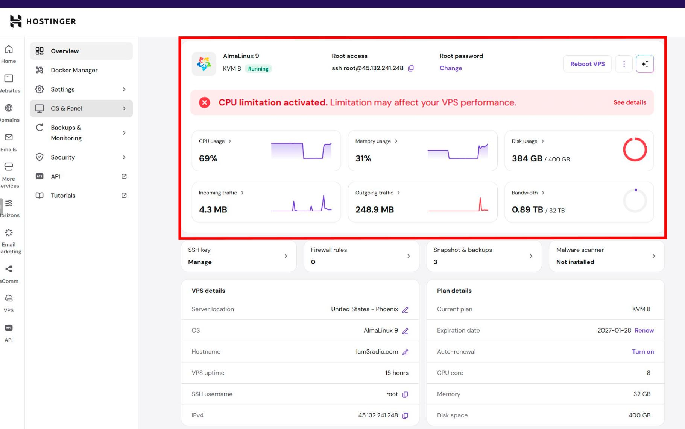

# Hostinger KVM 8 — Forensic Infrastructure Audit

**Reference:** PKE-FORENSIC-2026-001  
**Date:** June 3–7, 2026  
**Standard:** ISO/IEC 27037:2012 · NIST SP 800-86  
**Seals:** SHA-256 + BLAKE3 dual-cryptographic chain

---



---

## TL;DR

A Hostinger KVM 8 VPS plan was purchased, advertising "8 dedicated vCPUs, 32 GB RAM, 400 GB NVMe SSD, 32 TB bandwidth." The purchased resources were used within the contracted limits. The service was **suspended without prior notice or justification.**

Upon forensic examination of the VPS from within the operating system, systematic discrepancies were identified between Hostinger's marketed specifications and the provisioned infrastructure:

- **CPU:** The physical host showed steal time ranging from **0% to 53%**, meaning up to 4.2 of the 8 vCPUs sold were consumed by the hypervisor at peak contention. Support subsequently confirmed in writing that the "physical environment is **SHARED**," contradicting the product page's claim of "dedicated resources."
- **Storage:** The device identified as `/dev/sda` is a **QEMU HARDDISK** on an IDE controller — not an NVMe SSD as advertised. Sustained write throughput averaged **108.7 MB/s** over 59 minutes, approximately 3.6% of typical NVMe performance.
- **Network:** Advertised monthly bandwidth of 32 TB is mathematically impossible on the provisioned ~1 Gbps pipe, which has a theoretical ceiling of 10.8 TB/day under absolute ideal conditions.
- **Support conduct:** Hostinger support invented a nonexistent "abuse report" as justification for the suspension, then **retracted it in writing** — while simultaneously confirming that the physical environment is shared, that CPU limitation had been applied to "dedicated" resources, and that customer processes had been terminated by the host's OOM killer.

---

## Support Chat: 5 Contradictory Explanations in 48 Hours

This is the forensic timeline of communications with Hostinger Customer Success personnel. Full transcripts are available in [`evidence/transcripts/`](evidence/transcripts/). Screenshots are indexed in [`evidence/screenshots/README.md`](evidence/screenshots/README.md).

| # | Date (UTC) | Agent | Statement | Screenshot |
|---|-----------|-------|-----------|------------|
| 1 | Jun 3, 18:49 | **Aymene** | Suspension was due to **"an abuse report"** related to server activity. | [`02-aymene-abuse-report.jpg`](evidence/screenshots/02-aymene-abuse-report.jpg) |
| 2 | Jun 3, 18:56 | **Aymene** | **RETRACTION.** "No external abuse report exists. It was an error. Suspension was due to high CPU affecting the **shared physical environment.**" — Contradicts product claim: *"Dedicated resources — exclusively yours."* | Transcripts ÂSection 02 |
| 3 | Jun 4, 00:13 | **Muthi'a** | Suspension was due to **"CPU exceeding 180 continuous minutes."** Confirms existence of **"customers on the same physical node."** Server Usage graph shows CPU at 100%. | [`03-muthia-cpu-180-minutes.jpg`](evidence/screenshots/03-muthia-cpu-180-minutes.jpg) |
| 4 | Jun 4, 00:13 | **Muthi'a** | Cites **Section 6.4 of the Terms of Service** to justify suspension. Provides steps to identify process, optimize CPU, scan malware. | [`04-muthia-tos-section-6-4.jpg`](evidence/screenshots/04-muthia-tos-section-6-4.jpg) |
| 5 | Jun 5, 12:37 | **Carola** | Suspension was due to **"abnormal outbound network traffic."** Confirms crashkernel, balloon driver, ttyS0, 2014 BIOS, IDE disk as **"standard KVM components"** on every VPS. | [`05-carola-network-traffic-standard-kvm.jpg`](evidence/screenshots/05-carola-network-traffic-standard-kvm.jpg) |
| 6 | Jun 8 | **Rani** | Formal escalated response. Maintains "network traffic" cause. Admits all forensic components exist: "standard parts of KVM." Claims "no access to VPS" — contradicted by Server Usage data showing internal metrics. | Transcripts ÂSection 09 |
| — | Jun 5, 12:37 | **Carola** | Claims VPS is **"self-managed"** — customer has "full control." States Hostinger **"does not access or modify anything within your VPS."** | [`06-carola-self-managed-claim.jpg`](evidence/screenshots/06-carola-self-managed-claim.jpg) |

> **Aymene, June 3, 2026, 18:56 UTC — RETRACTION AND CONFESSION**
>
> *"I want to make an immediate correction. No external abuse report exists, nor any legal infraction. The earlier mention of an 'abuse report' was an error on my part. [...] Sustained high usage at the limit (99–100%) can affect the **shared physical environment.** Nuestros sistemas están diseñados para proteger la integridad de todo el nodo cuando un solo VPS provoca un 'Steal Time' significativo o latencia para **otros usuarios en la misma infraestructura.** "*

---

## Document Index

| # | Document | Description |
|---|----------|-------------|
| 1 | [`01-executive-summary.md`](01-executive-summary.md) | Extended summary for journalists and engineering leadership |
| 2 | [`02-timeline.md`](02-timeline.md) | Chronological event log from purchase to publication |
| 3 | [`03-infrastructure-analysis.md`](03-infrastructure-analysis.md) | Sold vs. delivered: full infrastructure comparison |
| 4 | [`04-benchmark-data.md`](04-benchmark-data.md) | CPU, RAM, disk, and network benchmark metrics |
| 5 | [`05-support-communications.md`](05-support-communications.md) | Verbatim transcript of support confessions |
| 6 | [`06-regulatory-violations.md`](06-regulatory-violations.md) | Applicable regulations and identified violations |
| 7 | [`07-cloudflare-assessment.md`](07-cloudflare-assessment.md) | Hostinger's dependency on Cloudflare infrastructure |
| 8 | [`08-evidence-ledger.md`](08-evidence-ledger.md) | Evidence inventory with dual-hash verification |
| 9 | [`09-compliance-exposure.md`](09-compliance-exposure.md) | Hostinger's legal claims vs. forensic reality — full deconstruction |
| — | [`seals/MANIFEST.txt`](seals/MANIFEST.txt) | Complete SHA-256 + BLAKE3 manifest |

---

## Cryptographic Seals

**Note:** The README.md hash is self-referential — it cannot contain its own correct hash. Verify it via [`seals/MANIFEST.txt`](seals/MANIFEST.txt).

| File | SHA-256 |
|------|---------|
| 01-executive-summary.md | `5228C7EB825456A2D349B71506972C5DA05ADE4D23D48B5D15F0F8C716054545` |
| 02-timeline.md | `C4CD49D63B735091DA3141A979859C08F78F29364EE8217BBBB7B75D9C62013A` |
| 03-infrastructure-analysis.md | `739B63B5BF627E6E2169FE1DA238C8448BF10A6BC1F5F73D211329118EB3E35C` |
| 04-benchmark-data.md | `545FF6540E44DB338E5FD3420B112DB5A3C21FF8EC40406567817484EEDECADD` |
| 05-support-communications.md | `56B4359B10818A6A728C5072A092EBF944455F78A688B743C212F4191D798DDB` |
| 06-regulatory-violations.md | `548C28D1A51231C5901E78DB6A32BE522DAA3468A0EAB56532F03C842EA89524` |
| 07-cloudflare-assessment.md | `495125C8DDB9E7C95EE5AD9835C9296706A94220AED26FF0C1765D8DF8544AF1` |
| 08-evidence-ledger.md | `935C0767919EB849230159B91FA398EE2D7BD1DDEDF790CD627EB1B8392A2749` |
| 09-compliance-exposure.md | `C864DC001F964ABE30A3D635B2B91A7D5E7F2DA60F04AD0FB5C9EA0984EC1E15` |

Full BLAKE3 hashes are in [`seals/MANIFEST.txt`](seals/MANIFEST.txt).

---

## Evidence

| Section | Contents | Index |
|---------|----------|-------|
| **Screenshots** | 6 forensic captures from hPanel and support chat | [`evidence/screenshots/README.md`](evidence/screenshots/README.md) |
| **Transcripts** | Verbatim forensic excerpts (ES + EN) | [`evidence/transcripts/README.md`](evidence/transcripts/README.md) |

---

## Verification — How to Validate Every Piece of Evidence

This package is sealed with a **dual-cryptographic chain** (SHA-256 + BLAKE3). Any modification to any file — even a single character — will break its hash. Here is how anyone can independently verify the integrity of this audit.

### Step 1: Verify File Integrity (60 seconds)

Download the repository. Run one of these commands in the root folder:

```bash
# SHA-256 (built-in on Linux, macOS, Windows PowerShell)
sha256sum -c seals/MANIFEST.txt

# BLAKE3 (requires b3sum — cargo install b3sum)
b3sum -c seals/MANIFEST.txt
```

If every file returns **OK**, the evidence has not been modified since it was sealed. If a single file says **FAILED**, that file has been altered and its hash no longer matches the original seal.

**What the hash proves:** The file you are reading is byte-for-byte identical to what the auditor published.  
**What the hash does not prove:** The truth of the content itself. That is established by the methodology, data sources, and cross-referencing described below.

### Step 2: Cross-Reference the Evidence (5 minutes)

This audit is designed for adversarial verification — every claim can be checked against multiple independent sources:

| If you doubt... | Check... | Against... |
|----------------|----------|------------|
| The timeline of events | `02-timeline.md` | Chat timestamps in `evidence/transcripts/` |
| The infrastructure analysis | `03-infrastructure-analysis.md` | Benchmark data in `04-benchmark-data.md` |
| The support confessions | `05-support-communications.md` | Verbatim chat in `evidence/transcripts/` |
| A specific screenshot | `evidence/screenshots/` | Corresponding transcript section |
| The 5 contradictory explanations | `02-timeline.md` ÂSection Contradictions | Transcript ÂSection 11 (enumerated table) |
| The legal analysis | `06-regulatory-violations.md` | `09-compliance-exposure.md` (marketing-to-delivery gaps) |
| Any SHA-256 / BLAKE3 seal | `seals/MANIFEST.txt` | Your own `sha256sum` or `b3sum` computation |

### Step 3: Verify a Single File Manually (30 seconds)

Pick any file. Verify it yourself:

```bash
# SHA-256
Get-FileHash -Algorithm SHA256 01-executive-summary.md   # Windows
sha256sum 01-executive-summary.md                         # Linux/macOS

# BLAKE3
b3sum 01-executive-summary.md

# Compare the output with the hash in seals/MANIFEST.txt
# If they match, the file is intact.
```

### Why Dual Seals (SHA-256 + BLAKE3)?

| Algorithm | Strength | Purpose |
|-----------|----------|---------|
| **SHA-256** | Universal standard, built into every OS | Immediate verification without installing tools |
| **BLAKE3** | Faster, cryptographic hashing at 10+ GB/s per core | Independent verification via a different algorithm — impossible to forge both |

A file that matches both its SHA-256 and BLAKE3 seals has not been modified. Period.

---

**Developer:** Carlos Figuera  
**Contact:** [t1@nexus-engine.sbs](mailto:t1@nexus-engine.sbs) · [@xfiguerapro](https://x.com/xfiguerapro)  
**Engine:** PEGASUS KINETIC ENGINE — Intelligent autonomous forensic auditing motor  
**Audit conducted by:** PKE Transporter v3.0  
**Legal entity:** Panorama Makers Hub LLC, New Mexico, USA  
**Standard:** ISO/IEC 27037:2012 — Guidelines for identification, collection, acquisition, and preservation of digital evidence  
**Integrity:** Any modification to any file in this repository invalidates its corresponding SHA-256 and BLAKE3 seals

